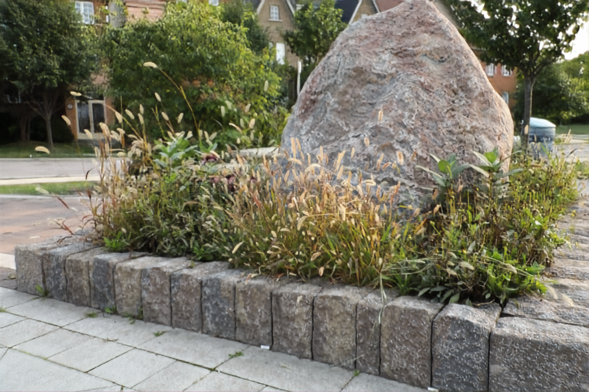
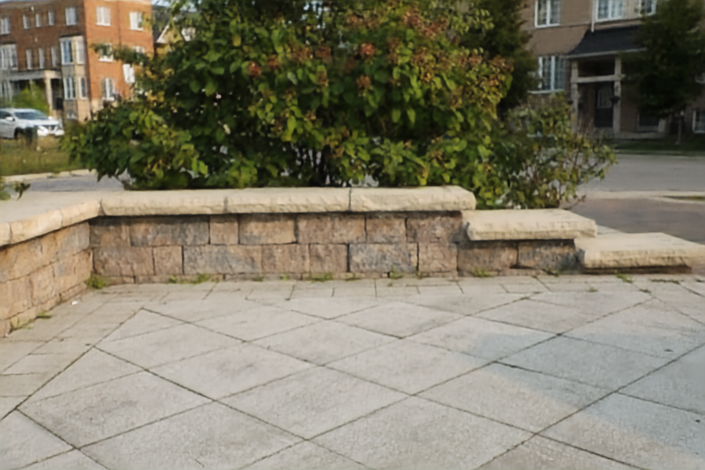

# ATTSF
Solution of Defocus Deblurring Challenge - [Attention! Stay Focus! (ATTSF)](https://competitions.codalab.org/competitions/28049#results) - NTIRE 2021
## Content
- [ATTSF](#attsf)
- [Getting Started](#getting-started)
- [Running](#running)
- [References](#references)
- [Citations](#citation)

## Getting Started

- Clone the repository

### Prerequisites

- Tensorflow 2.2.0+
- Tensorflow_addons
- Python 3.6+
- Keras 2.3.0
- PIL
- numpy


## Running
### Training 
- Preprocess
    - Download the [training data](https://ln2.sync.com/dl/66bc64370/u7hy9v4a-qrdjtr8z-xvwtpi2t-7fc2h7yv)

    - Unzip the file

- Train ATTSF 
    - change ```op_phase='train'``` in ```config.py```
    ```
    python main.py
    ```

- Test ATTSF
    - change ```op_phase='valid'``` in ```config.py```
    ```
    python main.py
    ```
## Usage
### Training
```
usage: main.py [-h] [--filter FILTER] [--attention_filter ATTENTION_FILTER]
                [--kernel KERNEL] [--encoder_kernel ENCODER_KERNEL]
                [--decoder_kernel DECODER_KERNEL]
                [--triple_pass_filter TRIPLE_PASS_FILTER] [--num_rrg NUM_RRG]
                [--num_mrb NUM_MRB]
```
```
optional arguments:
  -h, --help            show this help message and exit
  --filter FILTER
  --attention_filter ATTENTION_FILTER
  --kernel KERNEL
  --encoder_kernel ENCODER_KERNEL
  --decoder_kernel DECODER_KERNEL
  --triple_pass_filter TRIPLE_PASS_FILTER
```
### Testing
- Download the weight [here](https://drive.google.com/file/d/1eYEqdJCeUNAzd4UGbASH7FOW5SgFS3MR/view?usp=sharing) and put it to the folder ```ModelCheckpoints```

#### Result
        Left image         |       Right Image         |        Output
    |    | 
    |    | 
:-------------------------:|:-------------------------:|:-------------------------:
    |    |  
## License

This project is licensed under the MIT License - see the [LICENSE](https://github.com/tuvovan/ATTSF/blob/master/LICENSE) file for details

## References
[1] Defocus Deblurring Challenge - [NTIRE2021](https://competitions.codalab.org/competitions/28049#results)

## Citation
## Acknowledgments
- This work is heavily based on the code from the challenge [host](https://github.com/Abdullah-Abuolaim/defocus-deblurring-dual-pixel) . Thank you for the hard job.
